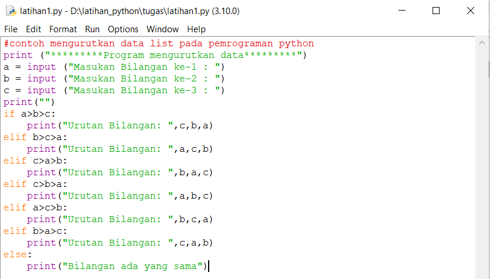
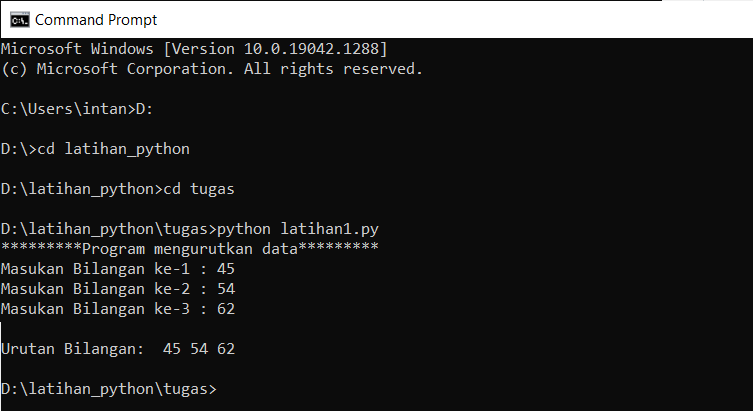
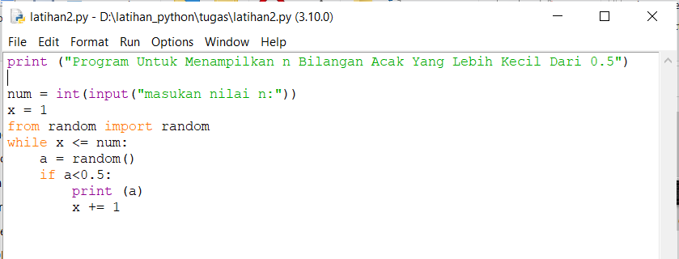
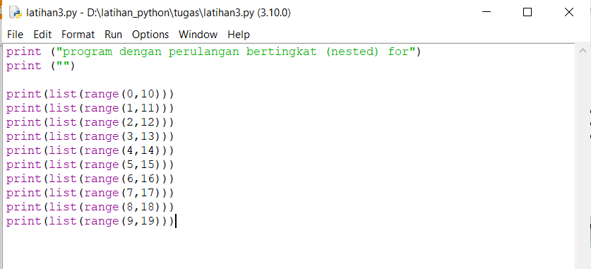
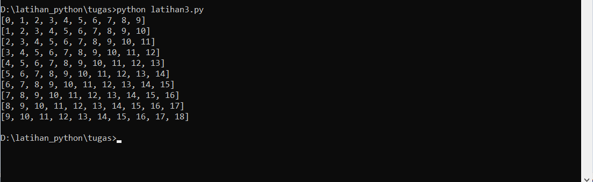
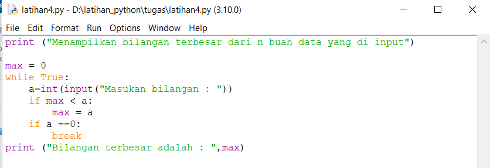

# labspy_03
# Latihan1
## Program mengurutkan data dari yang terkecil berdasarkan data yang di input

### Penjelasan alur program
1. "a=input : -untuk memasukan data" 
2. if a>b>c , print c,b,a : -Jika a>b>c maka tampilkan c,b,a 
3. elif b>c>a , print a,c,b : -dan b>c>a maka tampilkan a,c,b 
4. else , print Bilangan ada yang sama : -selain itu  maka tampilkan bilangan ada yang sama

#### (kondisi if elif) merupakan lanjutan/percabangan logika dari "kondisi if". Dengan elif kita bisa membuat kode program yang akan menyeleksi beberapa kemungkinan yang bisa terjadi. Hampir sama dengan kondisi "else", bedanya kondisi "elif" bisa banyak dan tidak hanya satu. Percabangan If/Elif/Else digunakan apabila terdapat lebih dari dua pilihan keputusan.
### Berikut tampilan program setelah dijalankan

# Latihan2
## Program Untuk Menampilkan n Bilangan Acak Yang Lebih Kecil Dari 0.5

### Penjelasan alur program
1. print("Tampilkan n bilangan acak yang lebih kecil dari 0.5") : - adalah perintah untuk menampilkan judulnya
2. num = int(input("Masukkan jumlah n: ")) - adalah perintah untuk menginput nilai n tersebut
3.
### Berikut tampilan program setelah dijalankan

# Latihan3
## Program dengan perulangan bertingkat (nested) for

### Penjelasan
>> Fungsi range() digunakan untuk mengembalikan deret bilangan bulat (integer) secara berurutan pada kisaran (range) yang sudah ditentukan dari start sampai stop.
### Berikut tampilan program setelah dijalankan

# Latihan4
## program untuk menampilkan bilangan terbesar dari n buah data yang diinputkan

### Penjelasan alur  program
1. print ('Menampilkan Bilangan Terbesar Dari N Buah Data Yang Diinputkan') Untuk menampilkan kalimat Menampilkan Bilangan Terbesar Dari N Buah Data Yang Diinputkan

2. max= 0 kode max disini untuk menentukan nilai max nya dalah 0

3. while true: Untuk perulangan hingga waktu yang tidak di tentukan atau selamanya

4. a=int(input("Masukan Bilangan :")) a untuk menginput tipe data interger ( bilangan bulat )

5. if max < a max=a jika max kurang dari a maka max = a

6. if a==0: break jika a= 0 maka akan berhenti dengan syarat break yang terpenuhi

7. print("Bilangan Tebesar Adalah :", max) Menampilkan *Bilangan Tebesar Adalah : Nilai maximumnya