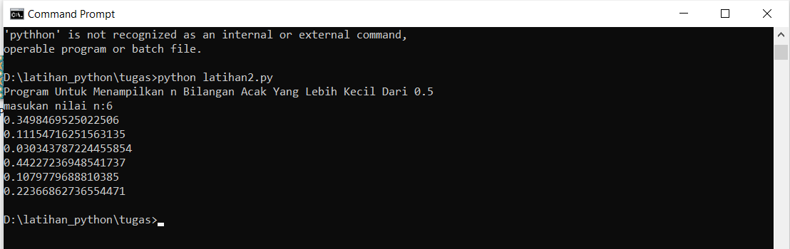

# labspy_03

# Latihan1

## Program mengurutkan data dari yang terkecil berdasarkan data yang di input

### Algoritma program

1. a=input : - memasukan data 
2. if a>b>c , print c,b,a : -Jika a>b>c maka tampilkan c,b,a 
3. elif b>c>a , print a,c,b : -dan b>c>a maka tampilkan a,c,b 
4. else , print Bilangan ada yang sama : -selain itu  maka tampilkan bilangan ada yang sama

### Penjelasan
 (kondisi if elif) merupakan lanjutan/percabangan logika dari "kondisi if". Dengan elif kita bisa membuat kode program yang akan menyeleksi beberapa kemungkinan yang bisa terjadi. Hampir sama dengan kondisi "else", bedanya kondisi "elif" bisa banyak dan tidak hanya satu. Percabangan If/Elif/Else digunakan apabila terdapat lebih dari dua pilihan keputusan.
### Berikut tampilan program setelah dijalankan

# Latihan2

## Program Untuk Menampilkan n Bilangan Acak Yang Lebih Kecil Dari 0.5

### Algoritma program
1. Masukan Jumlah N pengulangan
2. Proses pengulangan sesuai jumlah pengulangan yang dinputkan
3. Tampilkan pengulangan dengan nilai di bawah 0.5
4. Selesai

### Penjelasan alur program

1. print("Tampilkan n bilangan acak yang lebih kecil dari 0.5") : - adalah perintah untuk menampilkan judulnya
2. num = int(input("Masukkan jumlah n: ")) - adalah perintah untuk menginput nilai n tersebut
3.
### Berikut tampilan program setelah dijalankan

# Latihan3

## Program dengan perulangan bertingkat (nested) for

### Penjelasan

>> Fungsi range() digunakan untuk mengembalikan deret bilangan bulat (integer) secara berurutan pada kisaran (range) yang sudah ditentukan dari start sampai stop.
### Berikut tampilan program setelah dijalankan

# Latihan4

## program untuk menampilkan bilangan terbesar dari n buah data yang diinputkan

### Algoritma program
1. mulai
2. input bilangan N
3. Jika max < a maka akan lanjut pengulangan 4.Jika a==0 maka akan berhenti proses pengulangan
4. Dan mencetak hasil nilai maxium dari N yang di isikan
5. Selesai

### Penjelasan alur  program
1. print ('Menampilkan Bilangan Terbesar Dari N Buah Data Yang Diinputkan') Untuk menampilkan kalimat Menampilkan Bilangan Terbesar Dari N Buah Data Yang Diinputkan

2. max= 0 kode max disini untuk menentukan nilai max nya dalah 0

3. while true: Untuk perulangan hingga waktu yang tidak di tentukan atau selamanya

4. a=int(input("Masukan Bilangan :")) a untuk menginput tipe data interger ( bilangan bulat )

5. if max < a max=a jika max kurang dari a maka max = a

6. if a==0: break jika a= 0 maka akan berhenti dengan syarat break yang terpenuhi

7. print("Bilangan Tebesar Adalah :", max) Menampilkan *Bilangan Tebesar Adalah : Nilai maximumnya

### Berikut tampilan program setelah dijalankan

# Latihan5

## Program Sederhana Untuk Menghitung Jumlah Laba Hasil Investasi Seorang Pengusaha Selama 8 Bulan

### Algoritma program
1. Mulai
2. Input modal misalkan x = 100.000.000 ( deklarasikan )
3. Input presentase untung a=0x, b=0x, c=0.01x, d=0.01x, e=0.05x, f=0.05x, g=0.05x, h=0.03x
4. For i in range (len (y)) pengulangan
5. Print (“laba bulan ke-“,i+1,”sebesar:” ,y[i])
6. Menghitung jumlah laba keseluruhan Z= (a+b+c+d+e+f+g+h)
7. Print (“jumlah laba selama 8 bulan adalah:”)
8. selesai

### Penjelasan alur program

1. print ('Jumlah Laba Hasil Investasi Seorang Pengusaha Selama 8 Bulan') Untuk Menampilkan kalimat Jumlah Laba Hasil Investasi Seorang Pengusaha Selama 8 Bulan

2. x=100000000 Dengan pemisalan atau dideklarasikan x adalah 100000000

3. print (" Modal Awal:",x) Menampilkan kalimat Modal Awal : dan data yang berisi di x yaitu 100000000

4. a=0x, b=0x, c=0.01x, d=0.01x, e=0.05x, f=0.05x, g=0.05x, h=0.03x Untuk Mendeklarasikan presentase laba tiap bulan dan di kali dengan x atau data inputan modal investasi yaitu 100000000

5. y=[a,b,c,d,e,f,g,h] untuk menentukan syarat y= yang berisi a,b,c,d,e,f,g,h

6. For i in range (len (y)) Print (“laba bulan ke-“,i+1,”sebesar:” ,y[i]) untuk perulangan data dengan isi data yaitu Ydengan menampilkan urutan laba perbulan sesuai range yang di tentukan dengan hasil ke untukan yang di inpput dari data Y

6. Z= (a+b+c+d+e+f+g+h) Print (“jumlah laba selama 8 bulan adalah:”) Z berisi data penjumlahan data angka yang ada didalam kode a,b,c,d,e,f,g,h yang akan di tampilakan atau dicetak di jumlah laba selama 8 bulan

### Berikut tampilan program setelah dijalankan

